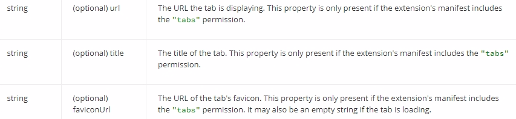

# FuzzTabs

FuzzTabs is an extension for the Google Chrome browser which organizes your tabs in a vertical, scrollable list and enables you to search in your tabs.

## Installation

## How To

1. <kbd>Ctrl</kbd> + <kbd>Shift</kbd> + <kbd>F</kbd> opens the FuzzTabs popup.
2. In the searchbar you can search by your tabs titles and URLs.
3. Click on the tab which you want to focus.

### Keyboard Shortcuts

<kbd>Tab</kbd> Cycle trough Tabs (and searchbar), beginning at the searchbar, moving down.

<kbd>Shift</kbd> + <kbd>Tab</kbd> Cycle trough Tabs (and searchbar), beginning at the currently selected element, moving up.

<kbd>Enter</kbd> Set focus on the selected tab (you have to select a tab in your search results before)

## Privacy

**Your data will not be used** for anything else than the FuzzTabs functionality.

### Requested Permissions

FuzzTabs only uses the permissions it needs.

See the Google Chrome [documentation](https://developer.chrome.com/extensions/declare_permissions) for more information about permissions.

#### Tabs

Requested because FuzzTabs needs to read the *titles*, *URLs* and the *URLs of the favicons* of your tabs.

